# Forma AI – System Architecture & Integration Blueprint

This document defines the system architecture, component boundaries, state ownership, and verification pipelines for the **Forma AI – AI-Augmented Dynamic Form Engine**. It serves as the single source of truth for the development team before any implementation begins.

---

## 1. Existing Project Analysis

Before establishing the architecture, a comprehensive audit of the workspace was performed:
* **[README.md](file:///d:/Forma-Ai/README.md)**: Outlines the high-level goals, key features, tech stack, and division of team roles.
* **[client](file:///d:/Forma-Ai/client)**: Standard Vite + React boilerplate. 
  * [client/package.json](file:///d:/Forma-Ai/client/package.json) specifies React 19, Vite 8, React Hook Form (`^7.86.0`), Zustand (`^5.0.15`), and Axios (`^1.20.0`).
  * [client/src/App.jsx](file:///d:/Forma-Ai/client/src/App.jsx) contains only Vite template code. There are currently no application directories (components, stores, schemas, or hooks).
* **[server](file:///d:/Forma-Ai/server)**: Minimal Express application.
  * [server/package.json](file:///d:/Forma-Ai/server/package.json) defines Node environment packages with Express 5, Mongoose 8, LangChain 0.3, `@langchain/openai` 0.6, Zod 3.25, Helmet, CORS, and Nodemon.
  * [server/server.js](file:///d:/Forma-Ai/server/server.js) contains standard initialization logic: connecting to MongoDB and registering Helmet, CORS, Morgan, and JSON parsing. No endpoints, database models, AI route files, or security middlewares have been created yet.

### Current Implementation Gap
* **Implemented**: Server boilerplate (database connection, basic middleware) and frontend packages.
* **Empty/Missing**: Database schemas, API endpoints, Zustand stores, React Hook Form layouts, LangChain prompts/services, and core authentication structures.

---

## 2. Complete User Journey

The system orchestrates a workflow that bridges natural-language processing and structured form validation.

### Narrative Flow
1. **Authentication**: The user logs in via JWT authentication.
2. **Form Selection**: The user selects a specific form template (e.g., Insurance Claim or Health Intake).
3. **Form Schema Fetch**: The client requests the active form schema. The backend fetches it from MongoDB and returns the JSON-encoded schema contract.
4. **Dynamic Render**: The client dynamic renderer evaluates the schema and displays the appropriate UI fields.
5. **Magic Input (AI Extraction)**: The user enters an unstructured narrative (e.g., *"I was driving my Honda yesterday when a deer hit my car. The windshield broke and nobody was injured."*).
6. **AI Processing**: The client forwards this string to the Express backend. The backend passes it to the AI Service which processes it via LangChain and GPT, outputting structured JSON matches.
7. **Schema Matching & Prefill**: The client validates the AI output against the schema fields. Compatible data is injected into React Hook Form, dynamically pre-filling the fields.
8. **Branching Evaluation**: Client-side evaluation checks `showIf` dynamic logic rules based on the pre-filled fields (e.g., displaying details forms if an accident occurred).
9. **User Review & Correction**: The user reviews, manually overrides any incorrect pre-filled fields, and completes empty required fields.
10. **Validation & Submission**: The user saves a draft or clicks submit. The form undergoes React Hook Form client-side validation followed by Express backend-side schema validation before persistence to MongoDB.

### User Journey Flowchart

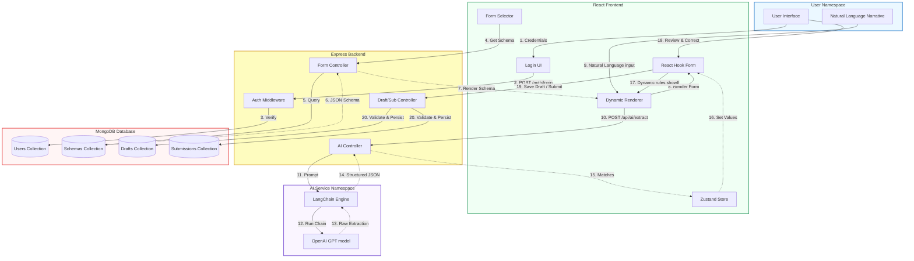

---

## 3. High-Level System Architecture Diagram

```mermaid
graph TD
    USER[USER]
    REACT[REACT FRONTEND]
    EXPRESS[EXPRESS BACKEND]
    DB[(MongoDB)]
    AIS[AI EXTRACTION SERVICE]
    LC[LangChain Engine]
    GPT[OpenAI GPT API]
    AUTH[JWT / Authentication]

    USER <-->|Interacts (Browser)| REACT
    REACT <-->|Authenticated HTTP Requests| EXPRESS
    
    EXPRESS <-->|Mongoose queries| DB
    EXPRESS <-->|Prompt & Payload| AIS
    EXPRESS <-->|Verify JWT & Passwords| AUTH
    
    AIS <-->|Chain execution| LC
    LC <-->|API Calls| GPT
```

### The Backend-AI Boundary Constraint
The architecture strictly enforces that **the React Frontend does not directly call the OpenAI/GPT API**. All AI invocations must route through the Express Backend. 

#### Rationale for the Frontend-Backend Separation:
1. **Credential Protection**: Storing API tokens (like `OPENAI_API_KEY`) on the client exposes them to end-users, inviting theft and abuse. Keeping keys in environment variables on the backend is secure.
2. **Prompt Safeguards**: Prompt templates (system instructions, structural output formats, and schema injections) must remain under developer control on the backend. Direct client calls would allow users to alter instructions or poison prompts.
3. **API Rate Limiting & Access Control**: The backend enforces rate limits, token budget restrictions, and authentication validation on routes before calling external downstream APIs.
4. **Validation and Sanitation**: The backend acts as a sanitization buffer, parsing AI output, trapping errors, and formatting payloads before delivery to the browser.

---

## 4. Form Schema Flow

The form schema governs the UI structure, field constraints, validation parameters, and conditional branching rules.

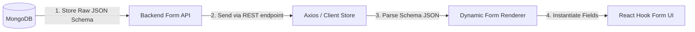

### Schema Contract – To Be Finalized
Because the concrete schema representation is pending development, the structure below serves as the **proposed JSON contract**:

```json
{
  "formId": "insurance_auto_claim_v1",
  "version": 1,
  "title": "Automobile Incident Claim Form",
  "fields": [
    {
      "id": "incidentType",
      "label": "Incident Category",
      "type": "select",
      "options": ["animal_collision", "vehicle_collision", "weather_damage", "theft", "other"],
      "required": true,
      "validation": {
        "message": "Please select a valid incident category"
      }
    },
    {
      "id": "vehicleMake",
      "label": "Vehicle Manufacturer",
      "type": "text",
      "required": true,
      "validation": {
        "pattern": "^[A-Za-z0-9\\s\\-]+$",
        "message": "Invalid characters in vehicle name"
      }
    },
    {
      "id": "injury",
      "label": "Were there any injuries?",
      "type": "boolean",
      "required": true
    },
    {
      "id": "injuryDetails",
      "label": "Describe the injuries",
      "type": "textarea",
      "required": true,
      "showIf": {
        "field": "injury",
        "value": true
      }
    }
  ]
}
```

---

## 5. AI Extraction Flow in Detail

When a user writes an unstructured narrative, the AI extraction logic interprets the text and translates it into structured values that correspond to the schema parameters.

### Natural Language Processing Sequence
1. **User input narrative**: *"I was driving my Honda yesterday when a deer hit my car. The windshield broke and nobody was injured."*
2. **Backend Submission**: The client dispatches the string payload to the API.
3. **Service Processing**: The AI service retrieves the prompt template, injects the user narrative, and requests a structured model output from OpenAI.
4. **LangChain & LLM Inference**: LangChain enforces schema conformance using structured output configurations (e.g., Zod schemas or OpenAI JSON-schema functions).
5. **AI Extraction**: The model outputs structured JSON data.

```
Narrative: "I was driving my Honda yesterday..."
  │
  ▼
Structured AI Extraction Output:
{
  "vehicleMake": "Honda",
  "incidentType": "animal_collision",
  "injury": false,
  "damageDetails": "broken windshield"
}
```

> [!IMPORTANT]
> **Hallucination Prevention**: The AI model's prompt instructions must forbid inventing or inferring data not explicitly in the text. Unmentioned parameters must be left `null` or omitted rather than guessed.
> **Status**: AI output is treated solely as a **suggestion**. It must not write to the database or bypass user inspection.

### AI Extraction Sequence Diagram

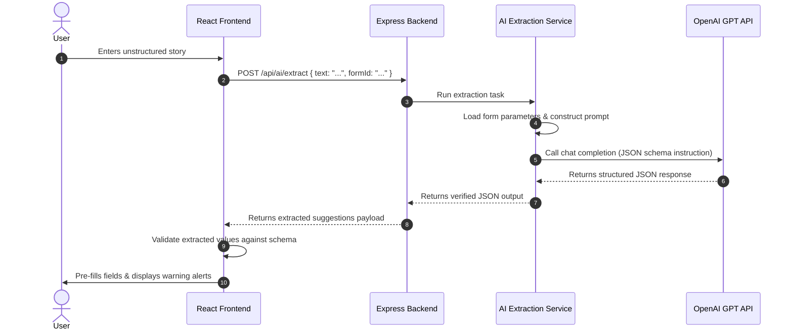

---

## 6. AI Data Integration & Form Population

Form pre-filling from unstructured text requires a client-side boundary system to catch format mismatches, invalid values, or omissions.

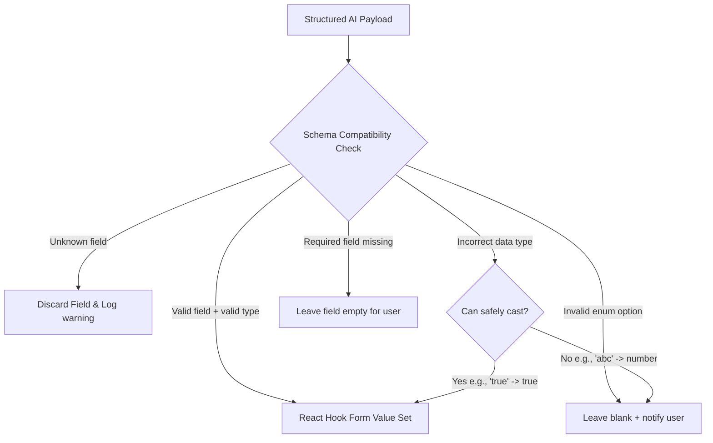

### Exception Recovery Matrix

| Scenario | System Action | UI / User Impact |
| :--- | :--- | :--- |
| **AI returns an unknown field** | Discard the value. Do not update RHF state. | No impact; hidden fields are not created. |
| **AI returns an invalid option** | Discard option. Keep form field empty. | Field shows warning: *"Unable to automatically match option."* |
| **AI returns the wrong data type** | Attempt safe casting. If unsafe, discard. | User is prompted to enter values manually. |
| **AI misses a required field** | Leave field empty. | Standard validation prompts user on form submission. |
| **AI returns no value** | Leave field empty. | Normal state; field is blank. |
| **AI extraction fails / times out** | Catch error. Log in state. | Alert banner displays: *"Extraction failed. Please fill the form manually."* |

---

## 7. Dynamic showIf Branching Logic

Conditional visibility allows the form to reveal or hide sections based on field values.

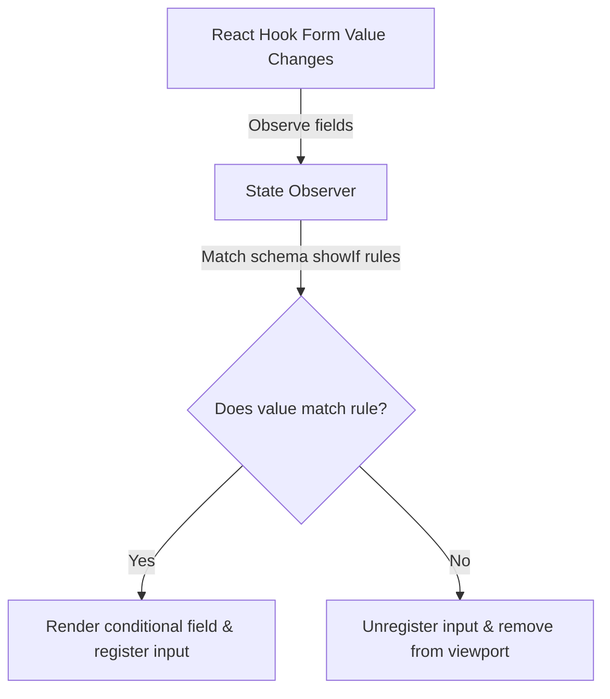

### Member Responsibilities for Dynamic Renderer:
* **Member 4 (Database & Workflow Specialist)**: Declares the conditional logical structures (e.g., `showIf` objects) within the JSON schema schema drafts.
* **Member 2 (Frontend Specialist)**: Implements the React conditional renderer component that watches field states and toggles sub-components dynamically.
* **Member 6 (State Management & QA Specialist)**: Writes integration test cases asserting that changing parent fields toggles target fields without state residue.

---

## 8. State Ownership Matrix

Establishing clear boundaries between client states avoids race conditions, out-of-sync state properties, and render bottlenecks.

```
        ┌────────────────────────────────────────────────────────┐
        │                 ZUSTAND GLOBAL STORE                   │
        │                                                        │
        │  * Active Form ID           * Loaded Schema Definition │
        │  * AI Processing Status     * Draft Save Status        │
        │  * Global Alert Notifications                          │
        └──────────────────────────┬─────────────────────────────┘
                                   │
                                   ▼ [Provides Schema Configuration]
        ┌────────────────────────────────────────────────────────┐
        │                  REACT HOOK FORM STATE                 │
        │                                                        │
        │  * Field-level values       * Touched / Dirty states   │
        │  * Client-side validation   * Form-level validation    │
        └────────────────────────────────────────────────────────┘
```

### State Boundary Definitions
* **React Hook Form (RHF)** is the **sole source of truth** for interactive input data, validation errors, field modifications, and standard submission states.
* **Zustand** is the **sole source of truth** for session configuration metadata, asynchronous execution metrics, processing flags, and UI-level alerts.

> [!WARNING]
> **No Value Mirroring**: Form field values must not be mirrored in the Zustand store. Syncing changes from RHF into Zustand on every keystroke causes rendering delays and invalidates the single source of truth rule.

---

## 9. User Data vs. AI Data Lifecycle

Structured AI data is an operational suggestion. Submission schemas require absolute user confirmation before the payload is persisted.

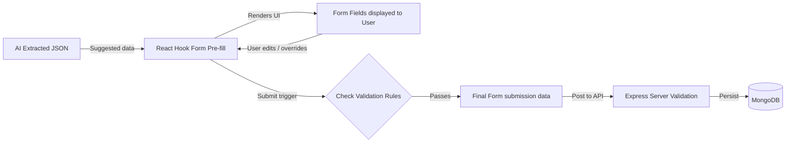

* **AI Output**: A temporary data mapping layer used to pre-populate React Hook Form.
* **User Input**: The ultimate truth. User changes overwrite AI pre-fills, and final form submission is built entirely from verified client-side form values.

---

## 10. Database Schema Responsibilities

MongoDB stores schema declarations, user identities, drafts, and submissions. Mongoose models will enforce structures matching these boundaries:

### Target Database Schema Entities

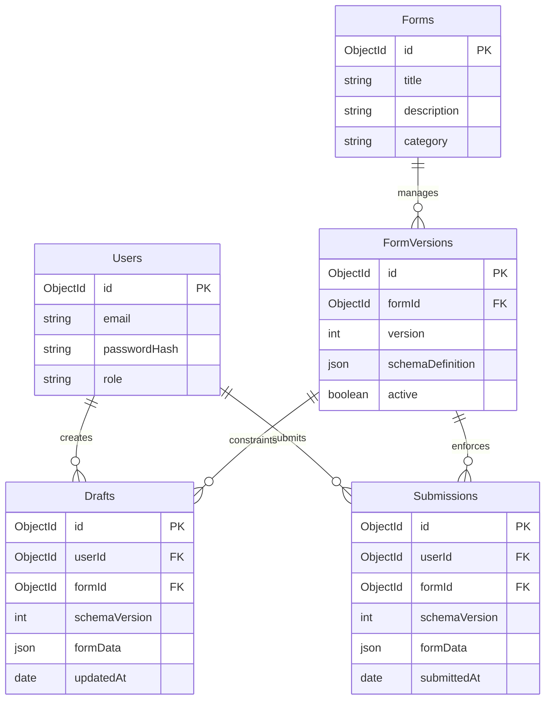

---

## 11. Schema Versioning for Save & Resume

Forms change over time. Outdated drafts must be read using the exact schema version present at draft creation.

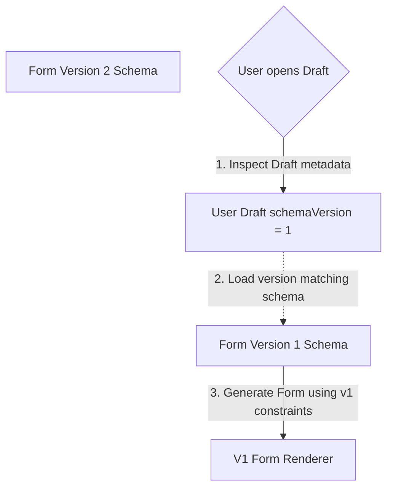

To prevent validation failures when schemas update:
1. Every draft records the exact `schemaVersion` it was initialized with.
2. The frontend dynamic renderer requests the schema matching the draft's version, ensuring the user resumes editing the form they started.
3. Old drafts can be migrated to newer versions via database upgrade tasks, rather than dynamically on the client.

---

## 12. Save & Resume Flow

MongoDB acts as the single persistent target for draft states. Browser memory (`localStorage`) is not used for drafts.

```mermaid
graph TD
    subgraph Save
        A[User clicks Save Draft] --> B[React Hook Form extracts current data]
        B --> C[POST /api/drafts with formId, version, data]
        C --> D[Express Backend validates Auth Session]
        D --> E[Mongoose updates or inserts Draft document]
    end

    subgraph Resume
        F[User opens dashboard] --> G[GET /api/drafts]
        G --> H[Backend returns draft array]
        H --> I[User selects draft to resume]
        I --> J[GET /api/forms/:id?v=version]
        J --> K[Backend responds with matching schema]
        K --> L[Inject schema & data into RHF]
        L --> M[Form renders state to user]
    end
```

---

## 13. Final Submission Flow

To ensure data integrity, validation occurs on both the frontend and the backend before any write is finalized.

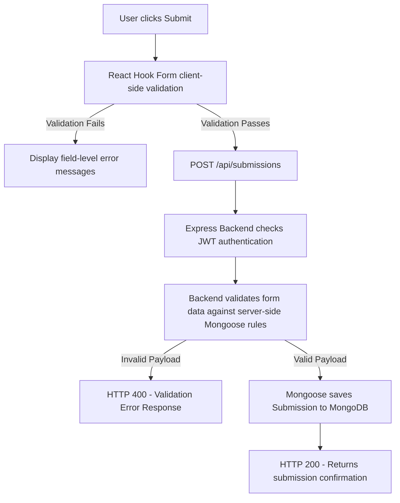

> [!IMPORTANT]
> **Server-side Validation Requirement**: Frontend validation is a visual guide for the user. Malicious agents can bypass the browser to submit raw payloads directly. The backend must enforce schema constraints before persistence.

---

## 14. Module Ownership Matrix

To coordinate execution across the team, features are allocated to specific roles:

| Role | Primary Responsibilities | Target Components |
| :--- | :--- | :--- |
| **Member 1 (Team Leader)** | Overall system structure, directory structure alignment, endpoint definition, code review reviews, branch merges. | System boundaries, routing design, environment files. |
| **Member 2 (Frontend Specialist)** | Layout creation, dynamic question rendering components, React Hook Form integration, UI design, Magic Input component. | [client/src/App.jsx](file:///d:/Forma-Ai/client/src/App.jsx), components, custom UI views. |
| **Member 3 (Backend Specialist)** | Express core app, controllers (auth, forms, drafts, submissions), routing structure, validation middlewares. | [server/server.js](file:///d:/Forma-Ai/server/server.js), routers, controllers. |
| **Member 4 (Database Specialist)** | MongoDB structure design, Mongoose model declarations, conditional rule representations, JSON schemas. | Mongoose Models, schema JSON files. |
| **Member 5 (AI Specialist)** | Prompt template architecture, LangChain structured output parsing, LLM context loading, AI route service. | Langchain integrations, prompt handlers. |
| **Member 6 (QA & State Specialist)** | Zustand state architecture, client error handling, integration verification testing, test scripts. | Zustand stores, testing modules. |

---

## 15. Member 6's Integration Verification Pipeline

Member 6 is responsible for checking that all modules connect and pass data correctly.

```
       [MongoDB Schema Definition]
                   │
                   ▼ [Forms API Delivery]
     [React Frontend Dynamic Renderer]
                   │
                   ▼ [Narrative submission]
        [AI Engine Extraction]
                   │
                   ▼ [Structured JSON mapping]
       [React Hook Form Validation]
                   │
                   ▼ [Submission Delivery]
       [Express Server Authentication]
                   │
                   ▼ [Server Validation Check]
       [MongoDB Persistent Submissions]
```

#### Integration Verification Focus Area:
Member 6 does not build these modules individually. Instead, Member 6 designs testing suites to verify:
1. **API Contracts**: Ensuring data structures do not shift between database queries and Axios responses.
2. **Schema Compliance**: Confirming that AI-extracted JSON models match the fields required by RHF.
3. **Branching State Integrity**: Validating that hidden fields do not leak data during form changes.
4. **Validation Alignment**: Verifying client-side error flags match backend Mongoose validation parameters.

---

## 16. Complete End-to-End Data Flow Diagram

This diagram displays the complete pipeline, tracking data flow across all system boundaries.

```mermaid
graph TD
    %% Define Styles
    style USER fill:#ebf8ff,stroke:#3182ce,stroke-width:2px
    style REACT fill:#f0fff4,stroke:#38a169,stroke-width:2px
    style EXPRESS fill:#fefcbf,stroke:#d69e2e,stroke-width:2px
    style AI fill:#faf5ff,stroke:#805ad5,stroke-width:2px
    style MONGO fill:#fff5f5,stroke:#e53e3e,stroke-width:2px

    subgraph USER [User Interface]
        U[User]
        NL[Accident Narrative input]
    end

    subgraph REACT [Client Runtime]
        Store[Zustand Store]
        Form[Dynamic Renderer]
        RHF[React Hook Form UI]
    end

    subgraph EXPRESS [Backend Server]
        API[Express Router]
        AIServ[AI Handler]
        Mongoose[Mongoose ODM]
    end

    subgraph AI [AI Services]
        Lang[LangChain Wrapper]
        LLM[GPT Model Endpoint]
    end

    subgraph MONGO [Database Engine]
        DB[(MongoDB Files)]
    end

    %% Data Pipeline Steps
    U -->|1. Opens Page| Store
    Store -->|2. GET /api/forms/:id| API
    API -->|3. Query Form Schema| Mongoose
    Mongoose -->|4. Read| DB
    DB -.->|5. Return Schema JSON| Mongoose
    Mongoose -.->|6. HTTP 200 payload| API
    API -.->|7. Set Schema| Store
    Store -.->|8. Propagate schema| Form
    Form -->|9. Register field nodes| RHF
    
    NL -->|10. Submit narrative| Form
    Form -->|11. POST /api/ai/extract| API
    API -->|12. Run chain process| AIServ
    AIServ -->|13. Inject narrative to schema context| Lang
    Lang -->|14. Request JSON schema structure| LLM
    LLM -.->|15. Parse JSON values| Lang
    Lang -.->|16. Cleaned extraction result| AIServ
    AIServ -.->|17. Return parsed fields| API
    API -.->|18. HTTP 200 response| Form
    Form ->|19. Check compatibility & values| RHF
    RHF -->|20. Trigger showIf rules| Form
    U -->|21. Edit / approve form values| RHF
    
    U -->|22. Click Submit| RHF
    RHF -->|23. Passes client checks| API
    API -->|24. Verify auth & enforce validation schema| Mongoose
    Mongoose -->|25. Write submission| DB
    Mongoose -.->|26. Write Success| API
    API -.->|27. HTTP 201 Created confirmation| Store
    Store -.->|28. Show Submission Alert| U
```

---

## 17. Sequence Diagram

This sequence diagram illustrates a complete, end-to-end user interaction: from opening a form, parsing a narrative with AI, reviewing values, to final submission.

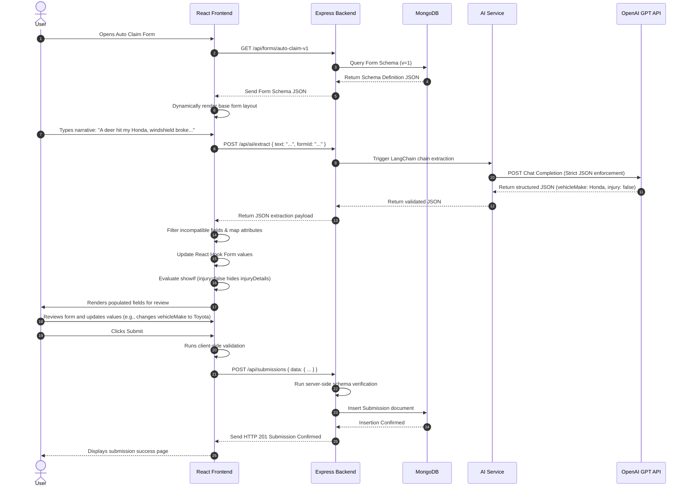

---

## 18. Architecture Audit

This audit evaluates the current boilerplate codebase and project plan, identifying potential structural issues and suggesting mitigation strategies:

### 1. State Syncing and Duplication Risks
* **Issue**: Storing active form inputs in both React Hook Form (for validation) and Zustand (for sharing data across files).
* **Risk**: Causes performance slowdowns on keystroke changes, triggers excessive UI re-renders, and risks out-of-sync form inputs.
* **Mitigation**: Establish RHF as the single source of truth for active form values. Zustand should only store static schemas, page steps, loading states, and form-level metadata.
* **Status**: Mandatory Guideline.

### 2. Client-Direct AI Invocations
* **Issue**: Client-side network code directly querying the OpenAI Completion endpoints.
* **Risk**: Exposes API secrets in browser developer consoles and allows prompt templates to be modified by clients.
* **Mitigation**: Enforce the Express Backend as the only route to external AI engines. The client must only interact with backend endpoints like `/api/ai/extract`.
* **Status**: Mandatory Guideline.

### 3. Server-side Validation Gaps
* **Issue**: Assuming that client-side React Hook Form validation makes backend checks redundant.
* **Risk**: Allows API request interception tools to post corrupt or incomplete database objects directly.
* **Mitigation**: Implement server-side schema validation (using Zod or Mongoose schemas) on all submit and draft API routes.
* **Status**: Mandatory Guideline.

### 4. Schema Drift on Client Side
* **Issue**: Creating React form components using static structures that do not match the schemas stored in MongoDB.
* **Risk**: Results in schema mismatch errors when saving drafts or final submissions.
* **Mitigation**: Generate form fields dynamically based on database schemas. Do not hardcode form validation rules in client components.
* **Status**: Mandatory Guideline.

### 5. Draft Compatibility Breakages (Schema Versioning)
* **Issue**: Loading a saved draft under a modified active form schema version.
* **Risk**: Causes layout bugs or validation errors when old drafts encounter new required fields.
* **Mitigation**: Store the active `schemaVersion` inside the draft document. Load drafts using their corresponding schema version.
* **Status**: Mandatory Guideline.

### 6. Loose Coupling between AI Extraction and Form Schemas
* **Issue**: The AI service returning fields that do not match the dynamic form schema.
* **Risk**: Results in errors when pre-filling fields or attempts to write invalid attributes.
* **Mitigation**: Implement a mapping and sanitization middleware on the frontend. This middleware validates and sanitizes AI payloads against active form schemas before updates.
* **Status**: Mandatory Guideline.

---

## 19. Contracts to Freeze Before Implementation

These data contracts must be finalized and signed off by the team before coding begins to prevent integration conflicts.

### Form Schema Contract
Defines the database schema layout and what the frontend dynamic renderer expects to receive.

```typescript
interface FormOption {
  label: string;
  value: string | number | boolean;
}

interface ValidationRules {
  required?: boolean;
  min?: number;
  max?: number;
  pattern?: string; // Regex validation
  message?: string; // Custom error message
}

interface ConditionRule {
  field: string;
  equals: any;
}

interface FormFieldSchema {
  id: string;
  label: string;
  type: "text" | "number" | "select" | "boolean" | "date" | "textarea";
  options?: FormOption[]; // Required for type: "select"
  validation?: ValidationRules;
  showIf?: ConditionRule; // Hidden unless condition matches
}

interface FormSchemaDocument {
  formId: string;
  version: number;
  title: string;
  description?: string;
  fields: FormFieldSchema[];
}
```
* **Status**: **OPEN DECISION** (Requires confirmation of validation schema keywords).

---

### AI Extraction Contract
Defines the payload structure returned by the backend AI extraction service.

```typescript
interface AIExtractionResponse {
  formId: string;
  extractedValues: {
    [fieldId: string]: string | number | boolean | null;
  };
  confidenceScores?: {
    [fieldId: string]: number; // Value between 0 and 1
  };
  rawNarrativeLength: number;
}
```
* **Status**: **OPEN DECISION** (Requires alignment on whether to include confidence scores in v1).

---

### API Endpoint Contract
Defines the routes and request/response payloads for client-server communication.

| Endpoint | Method | Request Payload | Response (200/201) |
| :--- | :--- | :--- | :--- |
| `/api/auth/login` | POST | `{ email, password }` | `{ token, user: { id, email } }` |
| `/api/forms/:formId` | GET | *None* | `FormSchemaDocument` |
| `/api/ai/extract` | POST | `{ narrative: string, formId: string }` | `AIExtractionResponse` |
| `/api/drafts` | GET | *None (JWT Auth)* | `DraftDocument[]` |
| `/api/drafts` | POST | `{ formId, schemaVersion, data: { ... } }` | `{ success: true, draftId: string }` |
| `/api/submissions` | POST | `{ formId, schemaVersion, data: { ... } }` | `{ success: true, submissionId: string }` |
```
* **Status**: **OPEN DECISION** (Requires routes verification).

---

### State Contract
Allocates application states to their respective stores.

* **React Hook Form Context**:
  * Form Values: `{ [fieldId: string]: any }`
  * Validation errors object
  * Touched status tracker
* **Zustand Application Store**:
  * `currentFormId`: `string | null`
  * `currentSchema`: `FormSchemaDocument | null`
  * `isExtracting`: `boolean` (AI processing spinner state)
  * `apiError`: `string | null`
  * `draftStatus`: `"idle" | "saving" | "success" | "error"`
* **Status**: **FROZEN** (No global sync of form field values).

---

### Persistence Contract
Defines what data is saved in draft states versus final form submissions.

* **Draft Document**: Contains partial form inputs. Required fields may be empty, and validation rules are not strictly enforced during save actions.
* **Submission Document**: Requires complete and valid form inputs. Validated against both client-side rules and backend constraints before write.
* **Status**: **FROZEN** (Enforces strict separation of validation rules for drafts vs. submissions).
